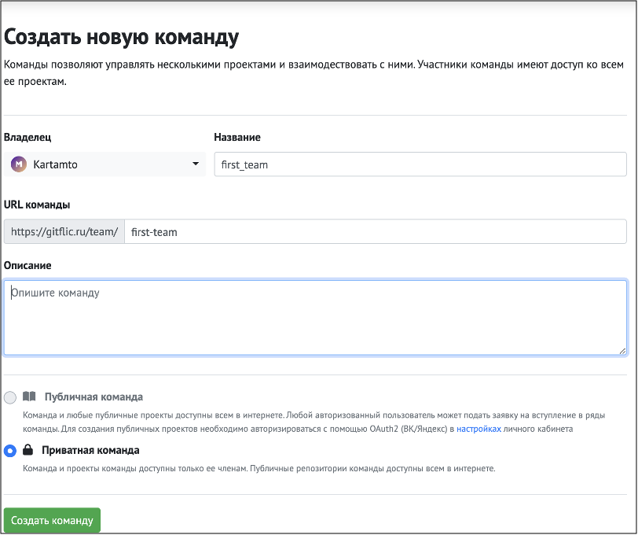
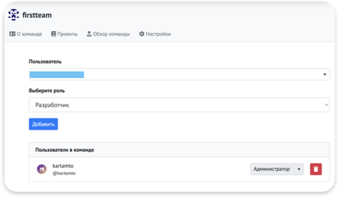
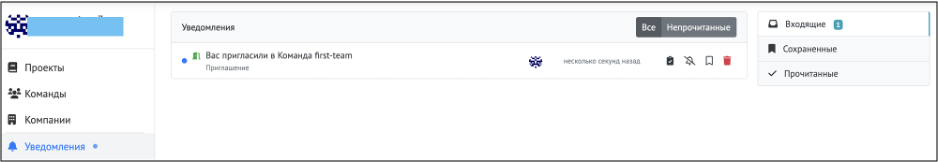
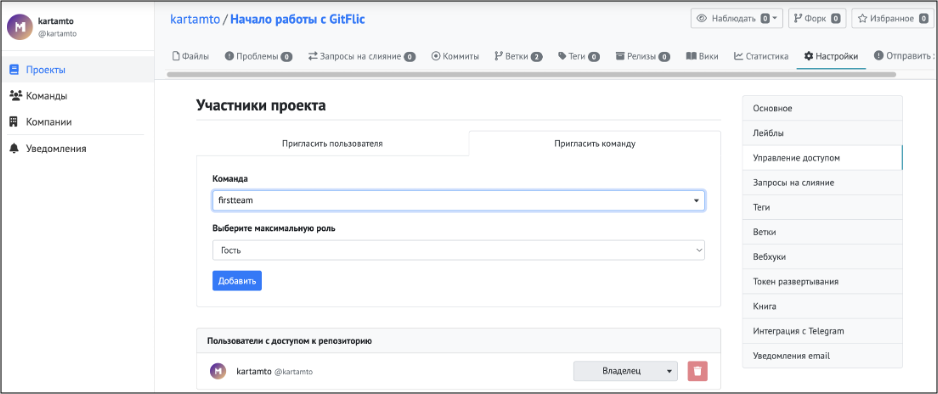
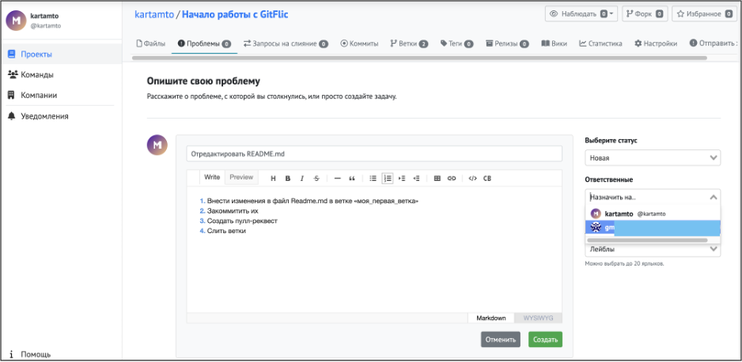
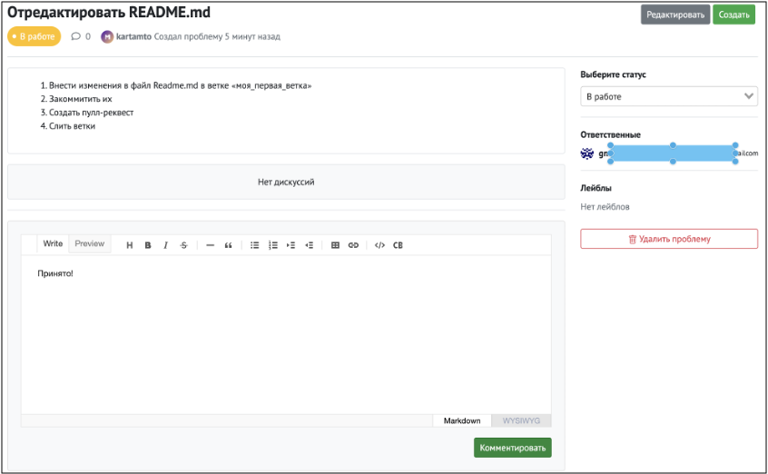
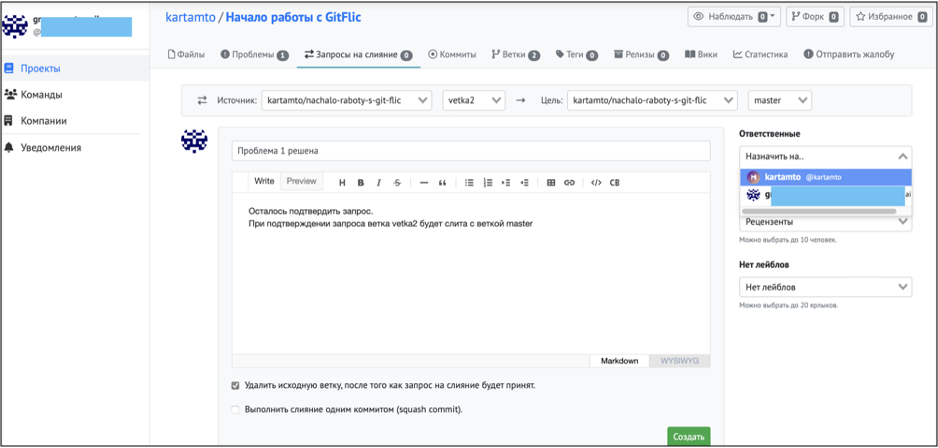
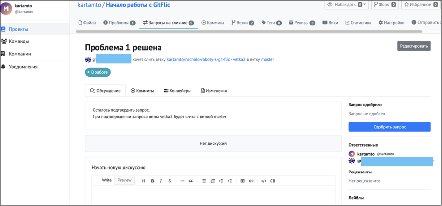
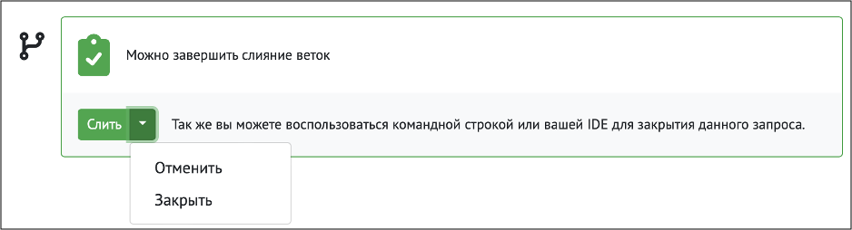
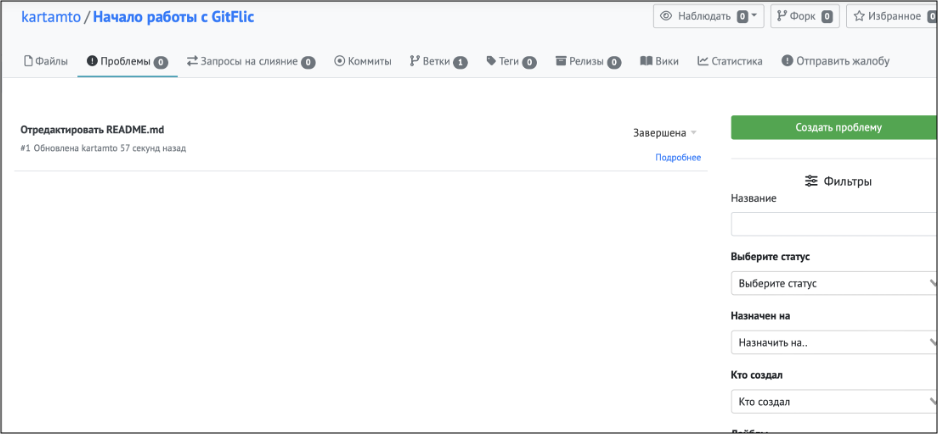

#Совместная работа над проектом с GitFlic

Совместная работа над проектом начинается с этого шага. С чего начать:

1. В боковом меню выбрать пункт ***Команды***.
2. На открывшейся странице перейти по ссылке ***Создайте свою первую команду***.
3. Ввести название и описание команды, нажать кнопку ***Создать команду***



После того, как команда создана, нужно добавить в нее участников. Для этого в разделе ***«Настройки» → «Управление доступом»*** нужно ввести имя пользователя в поле ***«Пользователь»*** и выбрать для этого пользователя роль. Возможны варианты: 

* «Гость»
* «Докладчик»
* «Разработчик»
* «Администратор»



После этих действий в интерфейсе GitFlic приглашенного участника появится *уведомление о приглашении в команду*. Для того, чтобы принять приглашение, достаточно перейти по ссылке в названии команды:



Следующим шагом пригласим команду в проект. Для этого нужно перейти в раздел ***«Настройки»*** проекта, выбрать в меню слева ***«Управление доступом»***, выбрать ***«Пригласить команду»*** (или ***«Пригласить пользователя»***), нажать кнопку ***«Добавить»*** 




На вкладке проекта **«Проблемы»** создадим задачу *«Отредактировать файл README.md»*. 

>Можно выбрать статус задачи («Новая», «В работе», «Отменена», «Завершена») и назначить исполнителей (до 15 человек). 

Список возможных исполнителей автоматически подгружается из состава команды. Пример оформления и назначения задачи



Назначенный исполнитель **не получает** уведомления о назначении ему задачи (только письмо на электронную почту), и может увидеть новую проблему перейдя в раздел ***«Проекты с моим участием» → «Проблемы»***. Исполнитель может сменить статус «проблемы» (например, на *«В работе»*), перейдя по ссылке в названии задачи может отредактировать ее или оставить комментарий:



Комментарии к задаче не появляются в уведомлениях участников в системе, увидеть их можно лишь перейдя по ссылке в названии задачи (**уведомления приходят на электронную почту**).
Далее опишем действия разработчика, для которого назначена задача. Действия выполняются в командной строке (терминале):

```
git branch vetka2					# создаем ветку с названием «vetka2»
git checkout vetka2					# переключение на новую ветку

```

Следующим шагом разработчик открывает требуемые файлы и вносит в них изменения (или добавляет новые файлы в свой локальный репозиторий проекта). Для того, чтобы изменения отразились на сервере, следует использовать команды git ("add", "commit" и "push"):

```
git add -A						# добавляем изменения в индекс проекта
git commit -m "Обновление README - Ветка создана, коммит"    # фиксируем изменения
git push origin vetka2			        # отправляем изменения на сервер, в ветку vetka2

```
Если задача выполнена, и исполнитель уверен, что добавленный (или исправленный) код можно и нужно слить в главную ветку проекта, он может создать запрос на слияние непосредственно в интерфейсе GitFlic.
>При создании запроса на слияние (merge request) указываются:
>
* **источник**, содержащий измененные файлы (директория и ветка)
* **цель** (директория и ветка);
-	заполняется **markdown-файл**, описывающий изменения;
-	**ответственный** (пользователь, уполномоченный выполнять слияние веток);
-	**рецензенты** (не влияет на действия ответственного, добавляет пользователей к обсуждению);
-	чек-бокс, позволяющий *настроить удаление текущей побочной ветки после слияния с основной*;
-	чек-бокс, позволяющий *выполнить слияние одним коммитом*.





Разработчик, назначенный ответственным за запрос на слияние, может просмотреть изменения, внесенные в файлы, коммиты (историю изменений), контейнеры, входящие в предлагаемый запрос.

Если что-то не устраивает ответственного (или рецензента), он может задать вопрос или добавить комментарий в разделе ***«Обсуждение»***:



Во время настройки запроса на слияние можно указать более одного ответственного, и (в бесплатной версии GitFlic) в таком случае одобрить запрос потребуется одному их них. После одобрения запроса на странице **«Запросы на слияние»** появится рамка с надписью **«Можно завершить слияние веток»**, предлагающая три варианта действий: 

* «Слить»
* «Отменить»
* «Закрыть» 

 Выбор одного из последних двух вариантов оставит текущий проект без изменений



После выполнения слияния на вкладке ***«Ветки»*** отобразится результат:



Так как задача решена, обновим статус *«Проблемы»*. После обновления страницы в таком случае счетчик проблем уменьшится на 1 :


###[Вернуться к оглавлению][README]
[README]:README.md