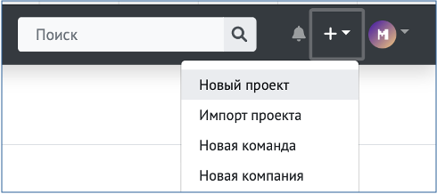
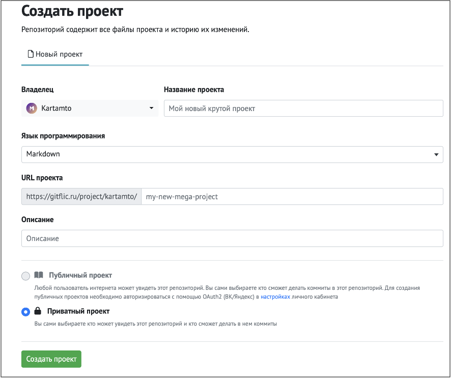
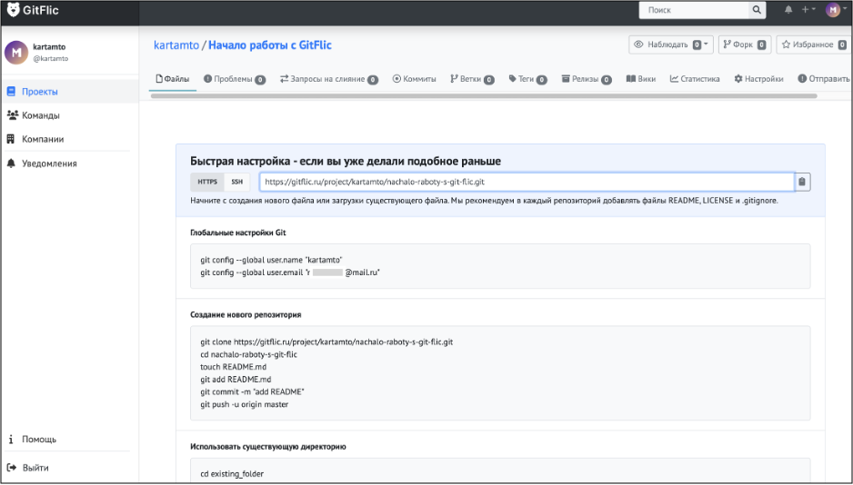
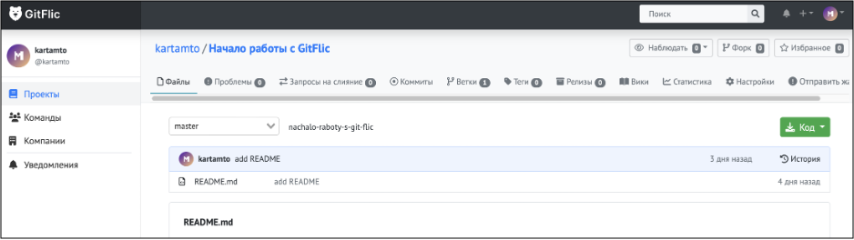
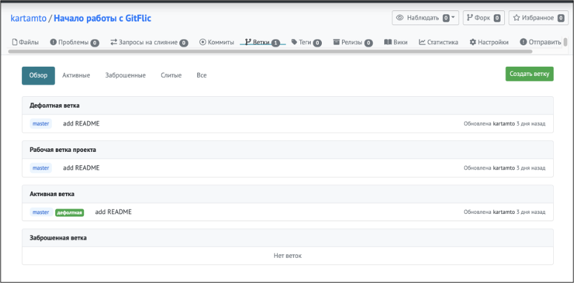
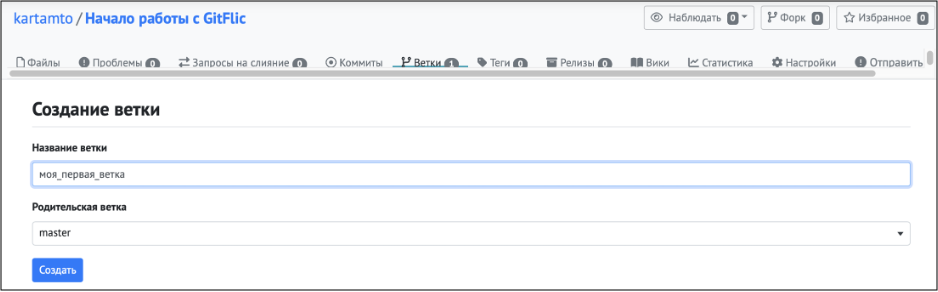
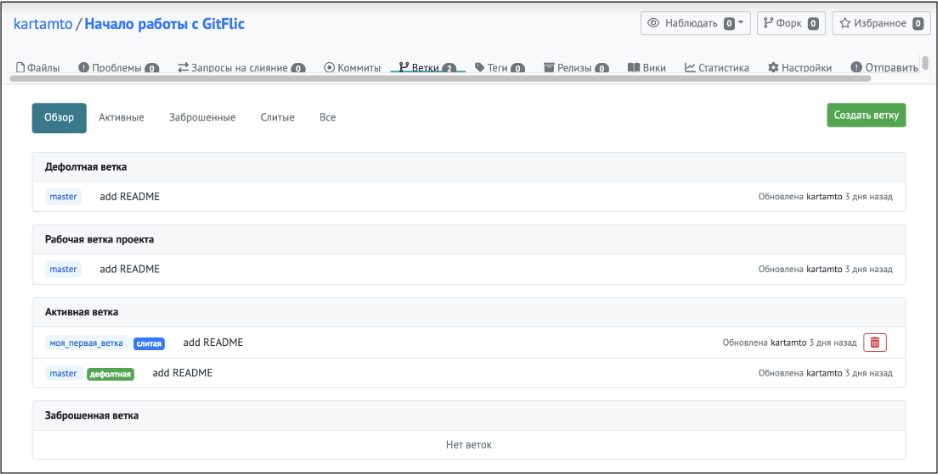

# Первоначальная настройка проекта

После регистрации на сайте <https://gitflic.ru/> пользователь попадает на страницу своего профиля. 

Для того, чтобы создать новый проект, нужно выбрать пункт из выпадающего списка «+» в правом верхнем углу страницы:




Следующим шагом нужно заполнить короткую форму (название проекта, выбрать язык программирования и ввести описание):



После создания проекта открывается его главная страница.



Все манипуляции с пользовательским репозиторием на GitFlic осуществляются в консоли операционной системы (в командной строке).

Дальнейшая работа по наполнению и настройке проекта будет идти через интерфейс командной строки. 

Для хранения проектов проектов желательно создать отдельную папку. Создадим папку, назовем ее «repo», сменим текущую директорию на «repo»:

```
cd ~/
mkdir repo
cd ~/repo

```

Следующим шагом копируем в командную строку построчно команды из разделов «Глобальные настройки Git»:

```
git config --global user.name "username"
git config --global user.email "username@usermail.ru"

```

Создание нового репозитория:

```
git clone https://gitflic.ru/project/username/nazvanie_repozitoriya.git
cd username/nazvanie_repozitoriya
touch README.md
git add README.md
git commit -m "add README"
git push -u origin master

```

Команда **git clone** копирует удаленный репозиторий по адресу *https://gitflic.ru/project/username/nazvanie_repozitoriya.git* и создает локальную копию в текущей директории.

Команда **cd** переходит в новую директорию «*nazvanie_repozitoriya*», созданную при клонировании.

Команда **touch** создает пустой файл *README.md*.

Команда **git add** добавляет *README.md* в индекс git.

Команда **git commit** фиксирует изменения, описанные в индексе, с сообщением *"add README"*.

Команда **git push -u origin master** отправляет изменения в удаленный репозиторий на сервере GitFlic и устанавливает связь между локальной веткой *master* и удаленной веткой *master* на сервере (если такая еще не существует).

>В результате выполнения последовательности этих команд мы клонировали репозиторий, создали файл **README.md**, добавили его в индекс **git**, зафиксировали изменения и отправили их на сервер **GitFlic**. Проект на сайте <https://gitflic.ru> после выполнения перечисленных команд выглядит следующим образом:
>


##Создание новой ветки проекта

По умолчанию репозиторий имеет одну ветку с названием ***main*** и она считается основной. Создание дополнительных веток позволяет скопировать основную ветку репозитория и безопасно вносить любые изменения, не нарушая основной проект. 

Ветки нужны для работы над конкретными функциями, не затрагивая другие части проекта.
Создать новую ветку проекта можно на вкладке **«Ветки»**:



Для этого нужно нажать кнопку ***«Создать ветку»***, ввести название ветки на открывшейся странице, выбрать «родительскую» ветку (на основе которой будет создана новая) и нажать кнопку ***«Создать»***:



После этого новая ветка отобразится на вкладке ***«Ветки»***:



Далее мы внесем изменения в файл ***Readme.md*** в новой ветке, закоммитим их, создадим пулл-реквест и сольем ветки. Для этого создадим команду проекта и «проблему» – задачу, назначаемую участникам проекта.
#### [Совместная работа над проектом][Co-Working.md] начинается с этого шага!
[Co-Working.md]:Co-Working.md

### [Вернуться к оглавлению][README]
[README]:README.md
